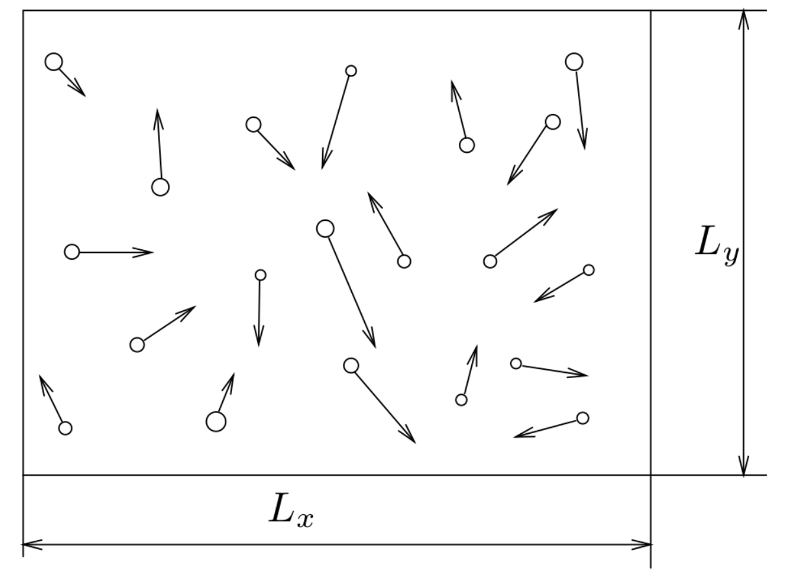
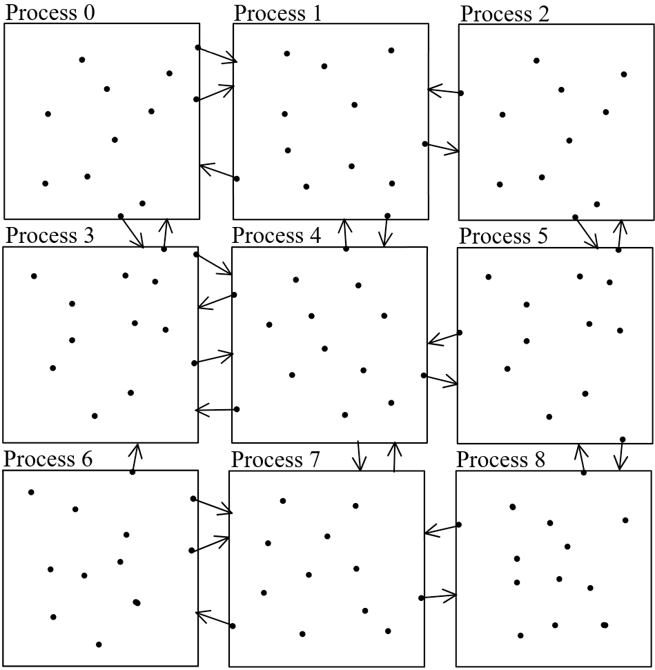
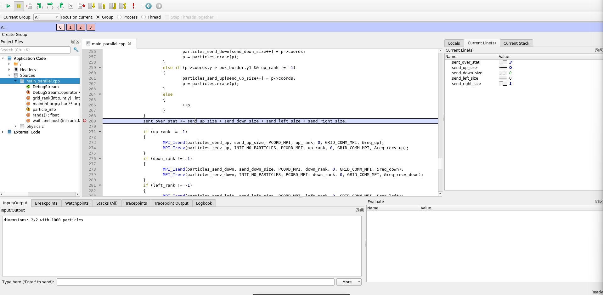
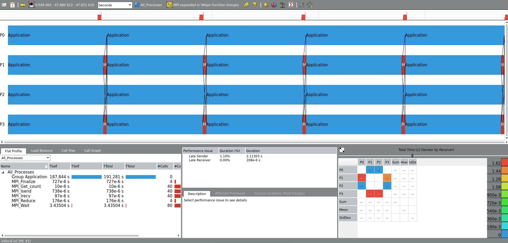
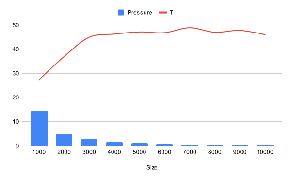
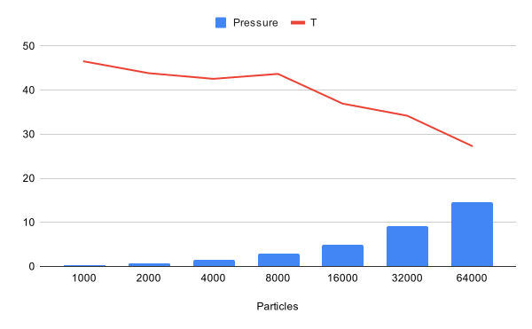
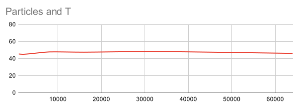
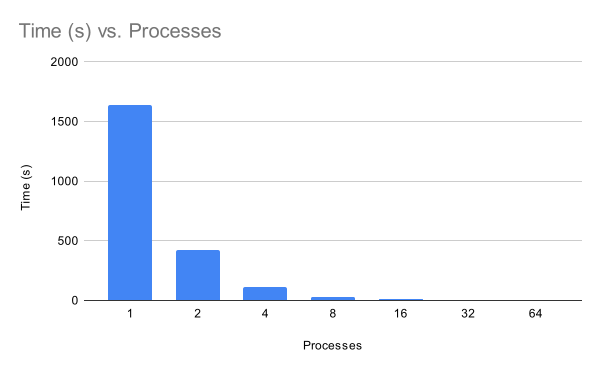

<div style="margin: 0 100px 0 100px;  font-family: 'Times New Roman';"> 
<h1 style="text-align: center; font-weight: normal;">TDDE65 Miniproject Report</h1>
<p style="text-align: center;">Albin Arvidsson albar556 <br>Martin Kaller marka727<p>
<p style="text-align: center;">May 15, 2024<p>

<div style="display: flex; justify-content: center; align-items:center; flex-direction: column;">
</img>
Figure 1: Particle simulation.
</div>

## 1&emsp;Introduction

We made a particle simulator with MPI (Message Passing Interface) <a style="color:inherit;" href="#reference1">[1]</a>, to verify the gas law $pV = nRT$. All particles had a radius of 1 and all collisions were perfectly elastic. No friction or other physical forces acted upon the particles. The particles moved around inside a rectangular space for simpler calculations, see <a style="color:inherit;" href="#figure1">figure 1</a>. MPI was used to speed up the calculations via parallelization. 

## 2&emsp;Method
We divided the box into a grid, where each process gets one cell. We use a 2 dimensional MPI layout for assigning the cell, see <a style="color:inherit;" href="#figure2">figure 2</a>. In the PCAM model we deemed the individual particles themselves to be elementary tasks in the partition step. In the communication and synchronization step we found that only particles with close proximity really need to communicate with each other, to be able to collide with each other. There also needs to be a global synchronization between each timestep. To reduce the communication between all of the particles as much as possible we agglomerated them into macro-tasks for which most communication is internal, namely the particles closest to each other in the same macro-task. We did this by sending particles between the macro-tasks when they go far away, and minimize the sending by maximizing the ratio between the area and the circumference of the macro-tasks. The agglomeration also went hand in hand with the mapping and scheduling, and we mapped one macro-task per processor. They all execute collision computations in parallel and barrier synchronize after each timestep.
<div style="display: flex; justify-content: center; align-items:center; flex-direction: column;">
</img>
Figure 2: MPI processes in a 2D grid, with particles in each process cell. Communications of particles leaving cell visualized.
</div>
<br>


```cpp
MPI_Comm GRID_COMM_MPI;
MPI_Cart_create(MPI_COMM_WORLD, 2, dims, periods, reorder, &GRID_COMM_MPI);
int my_coords[2];
int my_rank;
MPI_Cart_get(GRID_COMM_MPI, 2, dims, periods, my_coords);
MPI_Comm_rank(GRID_COMM_MPI, &my_rank);
```
Each process generates `TOTAL_PARTICLES/processes` amount of random particles. Particles are stored in `std::vector` (faster than `std::forward_list`, see discussion).
At the end of one timestamp iteration, we check which particles are outside of the process' cell. If it has a neighbor who could receive them, we remove the particles from our particle list and send them to our neighbor.
```cpp
unsigned send_up_size = 0, send_left_size = 0, send_right_size = 0, send_down_size = 0;

for (auto p = particles.begin(); p != particles.end();)
{
    if (p->coords.x < box_border.x0 && left_rank != -1)
    {
        particles_send_left[send_left_size++] = p->coords;
        p = particles.erase(p);
    }
    else if (p->coords.x > box_border.x1 && right_rank != -1)
    {
       // ...
    }
    else if (p->coords.y < box_border.y0 && down_rank != -1)
    {
        // ...
    }
    else if (p->coords.y > box_border.y1 && up_rank != -1)
    {
        // ...
    }
    else
    {
        ++p;
    }
}
```
All communications are done asynchronously in MPI with `MPI_Isend` and `MPI_Irecv`
```cpp
if (up_rank != -1)
{
    // begin send and receive
    MPI_Isend(particles_send_up, send_up_size, PCORD_MPI, up_rank, 0, GRID_COMM_MPI, &req_up);
    MPI_Irecv(particles_recv_up, INIT_NO_PARTICLES, PCORD_MPI, up_rank, 0, GRID_COMM_MPI, &req_recv_up);
}
// ... left, down, right

if (up_rank != -1) {
    // wait for response to be done
    MPI_Status status;
    MPI_Wait(&req_recv_up, &status);
    int count;
    MPI_Get_count(&status, PCORD_MPI, &count);
    for (size_t i = 0; i < count; i++)
    {
        particles.push_back({recv_buf[i], false});
    }
}
// ... left, down, right

MPI_Status tmp_status;

if (up_rank != -1)
{
    // finally wait for send request to be done
    MPI_Wait(&req_up, &tmp_status);
}
// ... left, down, right

```

#### 2.1&emsp;Limitations
- A particle can only collide with exactly one other particle.
- A particle can not both collide and bounce on the wall
    - Can causes a particle to be outside of box wall for one timestamp
- A particle needs two timesteps to travel diagonally
- Collisions can not happen between two cells in the border between them.


## 3&emsp;Debugging with DDT
<div style="display: flex; justify-content: center; align-items:center; flex-direction: column;">
</img>
Figure 3: DDT Debugger used to inspect sent data.
</div>
<br>

We used DDT for debugging, and gathering information during our miniproject. We encountered several issues during the implementation of the miniproject and used DDT to resolve them. For example issues with particles being sent to non-existent neighbors and just disappearing. We noticed our pressure results strangely diminishing with higher timestamps. With the help of DDT it was easy to identify the issue and determine what caused it. Another use case we used DDT for was measuring the amount of sent data and comparing it between each process each step. This was made easy with DDT, see <a style="color:inherit;" href="#figure3">figure 3</a>.

## 4&emsp;Performance analysis with ITAC
<div style="display: flex; justify-content: center; align-items:center; flex-direction: column;">
</img>
Figure 4: ITAC showing our program's executing trace.
</div>
<br>

We used ITAC during the miniproject to determine where the bottleneck in the system was. As can be seen in <a style="color:inherit;" href="#figure4">figure 4</a> we quickly determined that the computations were the heavy calculation, and that's where the optimization focus should lay for improved execution times. This differed from lab1b where the MPI communications were significantly more expensive than the actual calculations, so in lab1b we had to focus more on optimizing the MPI communications for better time performance. In the miniproject however we switched our focus to optimizing our application code, by for example improving cache locality by testing different data structures.

## 5&emsp;Results

The result regarding the ideal gas law, speedup and different implementations will be presented.

#### 5.1&emsp;Ideal gas law

The gas law $pV = nRT$ was verified by calculating the temperature $T$ based on the known values we got from running our program. If the program follows the gas law, then the temperature should remain constant for any combination of box size and particle amount. Our result can be seen in <a style="color:inherit;" href="#figure5">figure 5</a>, <a style="color:inherit;" href="#figure6">figure 6</a> and <a style="color:inherit;" href="#figure7">figure 7</a>

<div style="display: flex; justify-content: center; align-items:center; flex-direction: column;">
    </img>
    Figure 5: Relation between box size and temperature, with 32000 particles.
</div>
<br>

<div style="display: flex; justify-content: center; align-items:center; flex-direction: column;">
    </img>
    Figure 6: Relation between particle amount and temperature, with size 1000.
</div>
<br>

The simulation seems to follow the law quite well except when the ratio of particles to size is large.

<div style="display: flex; justify-content: center; align-items:center; flex-direction: column;">
    </img>
    Figure 7: Relation between particle amount and temperature, with size 10000.
</div>
<br>

With a smaller particle to size ratio, the ideal gas law is almost perfectly followed with a very straight line observed in <a style="color:inherit;" href="#figure7">figure 7</a>.

#### 5.2&emsp;Speedup
Speedup is measured with 32000 particles and 100 timesteps, over an exponent of two processes.
<div style="display: flex; justify-content: center; align-items:center; flex-direction: column;">
    </img>
    Figure 8: Relation between execution time and process amount, with 32000 particles and constant box size 10000.
</div>
<br>

<div id="table1" style="display: flex; justify-content: center; align-items:center; flex-direction: column;">
Table 1: Relation between execution time and process amount, with 32000 particles and constant box size 10000.

<div>

| Processes | 1      | 2      | 4      | 8      | 16     | 32     | 64     |
|-----------|--------|--------|--------|--------|--------|--------|--------|
| Time (s)  | 1636.98 | 422.378 | 110.662 | 28.0934 | 8.29144 | 2.23403 | 0.595723 |

</div>

</div>

The speedup of the program from using multiple processes can be seen in <a style="color:inherit;" href="#figure8">figure 8</a> and <a style="color:inherit;" href="#table1">table 1</a>. The speedup is superlinear, with a speedup of almost fourfold when the amount of processes is doubled. 

#### 5.3&emsp;Linear vs Linked List
A comparison of two different data structures can be seen in <a style="color:inherit;" href="#table2">table 2</a>, here it can be seen that the execution time is significantly faster when using std::vector.

<div id="table2" style="display: flex; justify-content: center; align-items:center; flex-direction: column;">
Table 2: Comparison of performance of std::forward_list and std::vector, with 32000 particles.

<div>

| Processes | 8      | 16     | 32     | 64     |
|-----------|--------|--------|--------|--------|
| Time (s) std::forward_list  | 47.7115 | 12.7871 | 3.8445 | 0.998647 |
| Time (s) std::vector | 28.0934 | 8.29144 | 2.23403 | 0.595723 |
</div>
</div>
<br>

#### 5.4&emsp;Grid vs rows
We measured how many particles are sent depending on if the layout is row or grid.
<div id="table3" style="display: flex; justify-content: center; align-items:center; flex-direction: column;">
Table 3: Comparison of particles sent each timestep for different layouts.

<div>

| Particles | Particles | Average sent particles |
|-----------|--------|--------|
| 1x64  | 100000 | 9782 | 
| 8x8 | 100000 | 2190 |
| 1x64  | 50000 | 5155 | 
| 8x8 | 50000 | 1083 |

</div>
</div>
<br>
Table 3 confirms that choosing a grid over rows results in less communication.


## 6&emsp;Discussion
Ideal gas law, superlinear speedup and memory layout will be discussed.

#### 6.1&emsp;Ideal gas law

The simulation follows the ideal gas law. As seen in figure 5 the temperature remain almost constant as size increases and pressure drops. With one exception, being that for small sizes, the temperature is lower than it should. This is likely due to that in a smaller space with many particles, there will be a lot more collision, due to our limitations, if a particle collides with another particle, it can not collide again in that timestep, resulting in less pressure.

In <a style="color:inherit;" href="#figure6">figure 6</a>, it can be observed that using many particles with a small size is not as accurate as using a larger size , as seen in figure <a style="color:inherit;" href="#figure7">figure 7</a>.

#### 6.2&emsp;Superlinear speedup
If running in $1$ processes, $t(n,1)= n^2$ operations are needed to check all collisions and complete one simulation timestep.

If running in $p$ processes, the particles is most often divided into $n/p$ particles per process. This would result in the operations per processor being $t(n,p) = (n/p)^2 $.

The relative speedup is thus $S_{rel}=\frac{t(n,1)}{t(n,p)} = \frac{n^2}{n^2/p^2} = p^2$.

This matches what we see in <a style="color:inherit;" href="#table1">table 1</a>, with $T(1)=1636.98$ and $T(2)=422.378$, resulting in a relative speedup of $T(1)/T(2)=3.87 \approx 2^2$

#### 6.3&emsp;Linear vs Linked List

We initially thought the linked list would have better performance, considering its cheaper insertion and deletion, which each simulation timestep has a lot of. Although the more expensive operations of vector seemed to be negligible due to the major performance increase that was gained from its cache locality. 

While analyzing the performance with ITAC, the linked list had more consistent computation time between communication steps across processes, since all operations are similarly expensive O(1), while on a vector, the operations vary from O(1) to O(n).

#### 6.4&emsp;Grid vs rows

Grid sends less particles per timestep due to its higher ratio between area and circumference. However rows communicates with fewer neighbors. This means that if the communication overhead is relatively expensive, rows can be better, while grid performs better with more expensive communication. 

## 7&emsp;Conclusion

In conclusion the model seems to be an alright estimation of the ideal gas law. It also benefits largely from parallelization. We were initially surprised by the superlienear speedup, but after looking into the theory of the course it made sense. This project also helped up learn that there are good debuggers for parallel programs, as well as how to use them. It also helped us learn how to use a traceanalyzer tool to further improve parallel programs. This project also helped us learn about the importance of cache locality, even if some other optimizations are sacrificed. This was ## References

## References


<div id="reference1"></div> 

1. Message Passing Interface :: High Performance computing. (n.d.). https://hpc.nmsu.edu/discovery/mpi/introduction/

</div>